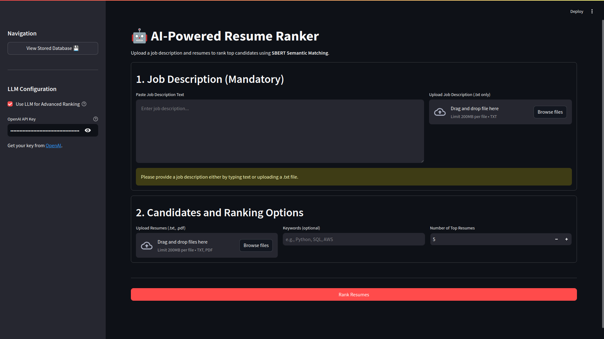
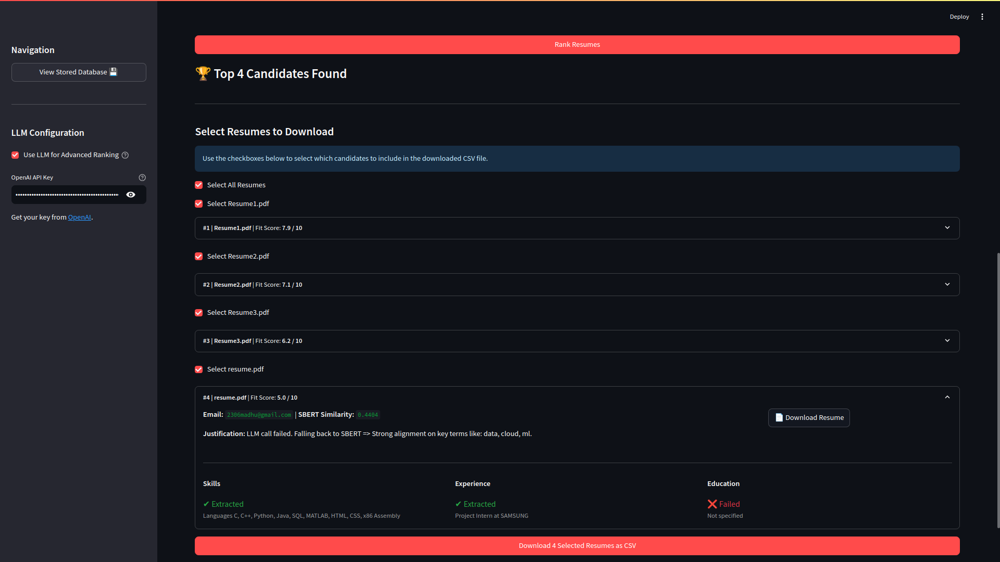

# AI-Powered Resume Ranker

The AI-Powered Resume Ranker is a web-based application that automates resume screening using natural language processing (NLP). Powered by Sentence-BERT (SBERT), it ranks resumes by semantic similarity to job descriptions, extracts email addresses, and filters candidates with keywords, removing stop words for precision. Explore the live app at [https://ai-resume-ranker-pb4m.onrender.com/](https://ai-resume-ranker-pb4m.onrender.com/). Built with Flask, it supports `.pdf` and `.txt` uploads, allows users to select the number of top candidates, and provides downloadable CSV results, streamlining recruitment.

## Features
- **Semantic Ranking**: Ranks resumes using SBERT (`all-mpnet-base-v2`) with cosine similarity to job descriptions.
- **Email Extraction**: Extracts email addresses from resumes via regex.
- **Keyword Filtering**: Filters resumes using TF-IDF-extracted keywords, with stop words (e.g., "seeking," "summary") removed.
- **Key Matches**: Identifies matching phrases between resumes and job descriptions using TF-IDF.
- **User Interface**: Flask-based interface for uploading resumes and job descriptions, inputting keywords, selecting top-N resumes, and downloading CSV results.
- **Dataset Validation**: Ensures dataset integrity by checking folder structure, PDF text extractability, and category alignment.
- **Optimizations**: Batch processing, pre-computed embeddings, and TQDM progress bars for performance.
- **Error Handling**: Robust handling for invalid files, empty inputs, and missing matches.
- **Deployment**: Hosted on Render at [https://ai-resume-ranker-pb4m.onrender.com/](https://ai-resume-ranker-pb4m.onrender.com/).

## Screenshots

*Upload `.pdf` or `.txt` resumes, job descriptions, keywords, and select top-N candidates.*


*View ranked resumes with similarity scores and email addresses, and download results as CSV.*

## Running Locally
1. **Run the Flask App**:
   ```bash
   python run.py
   ```
2. **Access the App**:
   - Open `http://127.0.0.1:5000` in a browser.
   - Upload resumes and a job description, input keywords (optional), select the number of top resumes, and view/download results as CSV.

## Deployment
The app is live at [https://ai-resume-ranker-pb4m.onrender.com/](https://ai-resume-ranker-pb4m.onrender.com/). To deploy your own instance on Render:
- Use `render.yaml` with `gunicorn wsgi:app`.
- Configure environment variables (e.g., `PORT`).
- Use `/tmp` paths for results storage.

## Dataset
The app expects a dataset with:
- A CSV file containing resume IDs, text, and job categories.
- PDF resumes organized by category.
- Text files for job descriptions, named by category.
Run `dataset_validator.py` to verify the structure:
```bash
python dataset_validator.py
```

## Limitations
- **Missing Categories**: Some job categories may be absent, limiting ranking for those roles.
- **Scanned PDFs**: Non-text-extractable PDFs require OCR (not implemented).
- **Pre-trained Model**: Uses `all-mpnet-base-v2` without fine-tuning, which may impact domain-specific accuracy.

## License
This project is licensed under the MIT License. See the [LICENSE](LICENSE) file for details.
