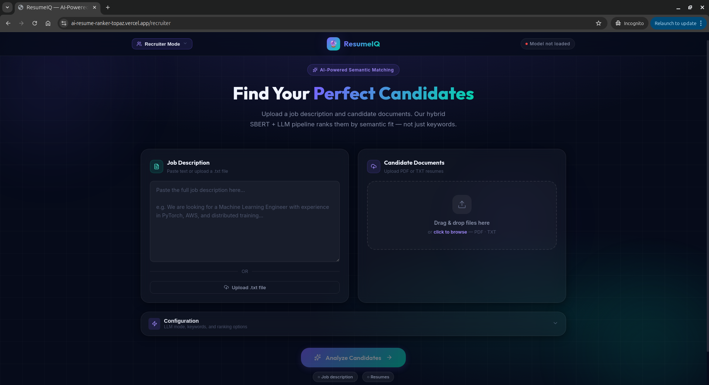
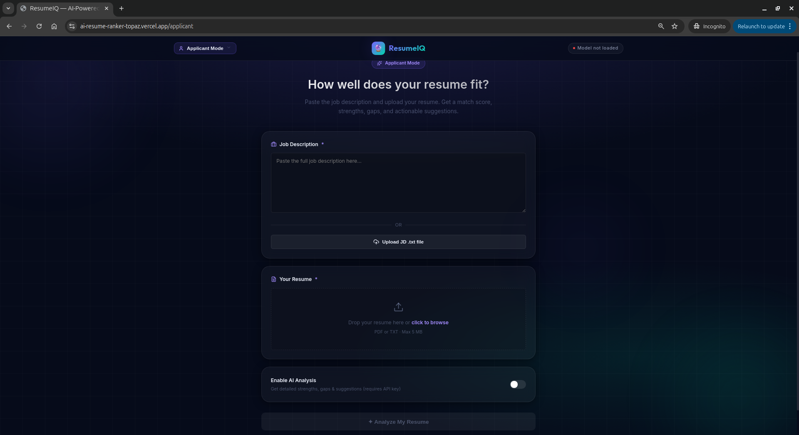

# ResumeIQ — AI-Powered Resume Ranker 🚀

**ResumeIQ** is a modern, full-stack web application that automates resume screening and self-evaluation using a **hybrid LLM + SBERT pipeline**. It features two distinct modes: a **Recruiter Mode** for bulk candidate ranking and an **Applicant Mode** for individual resume self-assessment.

🌐 **Live App:** [https://ai-resume-ranker-topaz.vercel.app](https://ai-resume-ranker-topaz.vercel.app)

> **Note:** The backend is hosted on Render's free tier and may take **up to 60 seconds** to wake up after a period of inactivity.

---

## Features

### Recruiter Mode
- **Bulk Resume Ranking**: Upload a job description and multiple candidate resumes (PDF or TXT) and get them ranked instantly.
- **Hybrid Scoring**: Uses **SBERT semantic similarity** as a baseline score and optionally upgrades to **GPT-powered Fit Scores (1–10)** with natural language justification.
- **LLM Scoring**: When an OpenAI API key is provided and LLM scoring is enabled, resumes are scored **exclusively by the LLM**, bypassing the local model entirely for a deeper qualitative analysis.
- **Keyword Pre-Screening**: Optionally filter candidates to only those whose resumes contain specified keywords before ranking.
- **Configurable Top-N**: Choose exactly how many top candidates to display in results.
- **Resume Download**: Download original candidate resume files directly from the results page.
- **CSV Export**: Export the full ranked results table as a CSV for further analysis.
- **Skills, Experience & Education Extraction**: Structured data is automatically extracted from each resume.

### Applicant Mode
- **Single Resume Analysis**: Upload your own resume and a job description to receive a personalised match assessment.
- **Match Score**: Get a percentage match score indicating how well your resume aligns with the role.
- **Strengths & Gaps**: Receive a breakdown of what your resume does well and what's missing relative to the job description.
- **Actionable Suggestions**: Get concrete, specific suggestions for improving your resume for the target role.
- **Keyword Recommendations**: See important JD keywords that are absent from your resume.
- **Enable AI Analysis**: Toggle on AI Analysis (requires an API key) to get detailed LLM-powered feedback.

---

## Screenshots

### Recruiter Mode

_Upload a job description and candidate documents. Configure LLM scoring, keyword filters, and the number of top results to display._

### Applicant Mode

_Upload your resume and a job description to get a detailed match score, strengths, gaps, and actionable improvement suggestions._

---

## Technical Stack

| Layer | Technology | Role |
| :--- | :--- | :--- |
| **Frontend** | **React + TypeScript + Vite** | Single-page application with Recruiter and Applicant modes |
| **Backend** | **FastAPI + Uvicorn** | REST API for resume processing and scoring |
| **Semantic Matching** | **SBERT** (`all-MiniLM-L6-v2`) via Hugging Face API | Cosine similarity scoring for SBERT-only mode |
| **Qualitative Scoring** | **OpenAI API** (GPT-3.5 / GPT-4) | LLM Fit Scores (1–10) and detailed justification |
| **PDF Parsing** | **pdfplumber + PyPDF2** | Text extraction from uploaded resume files |
| **Frontend Hosting** | **Vercel** | Static asset hosting with SPA routing |
| **Backend Hosting** | **Render** | Persistent Python web service |

---

## Running Locally

### Prerequisites
- Python 3.10+
- Node.js 18+

### Backend
```bash
# Install Python dependencies
pip install -r backend/requirements.txt

# Start the FastAPI server
uvicorn backend.main:app --host 0.0.0.0 --port 8000 --reload
```

### Frontend
```bash
# Navigate to the frontend directory
cd frontend

# Install Node dependencies
npm install

# Start the Vite dev server
npm run dev
```

The frontend dev server runs at `http://localhost:5173` and proxies API requests to the FastAPI backend at `http://localhost:8000`.

---

## Deployment

| Service | Platform | URL |
| :--- | :--- | :--- |
| **Frontend** | Vercel | [ai-resume-ranker-topaz.vercel.app](https://ai-resume-ranker-topaz.vercel.app) |
| **Backend** | Render | [ai-resume-ranker-pb4m.onrender.com](https://ai-resume-ranker-pb4m.onrender.com) |

The repository includes a `render.yaml` file that configures the backend deployment automatically on Render using:
- **Build Command**: `pip install -r backend/requirements.txt`
- **Start Command**: `uvicorn backend.main:app --host 0.0.0.0 --port $PORT`

---

## Limitations

- **LLM Dependency**: LLM-powered scoring requires a valid OpenAI API key provided by the user per-request. The key is never stored or logged.
- **SBERT-only Mode**: Without an API key, SBERT semantic similarity is used as the scoring method. Note that SBERT-only mode may be unavailable depending on Hugging Face API availability on the hosting environment.
- **PDF Extraction**: Complex table layouts or scanned (image-based) PDFs may yield inconsistent text extraction results.
- **Free Tier Cold Starts**: The Render backend may take up to 60 seconds to respond after 15+ minutes of inactivity.
