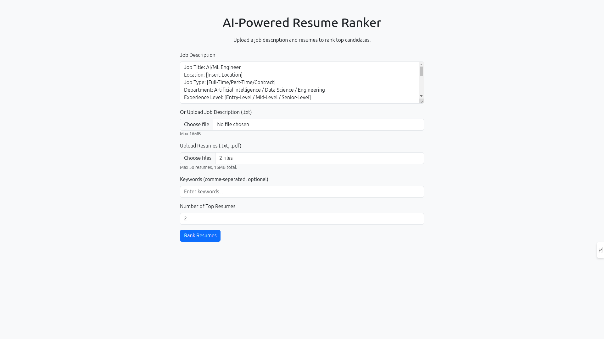
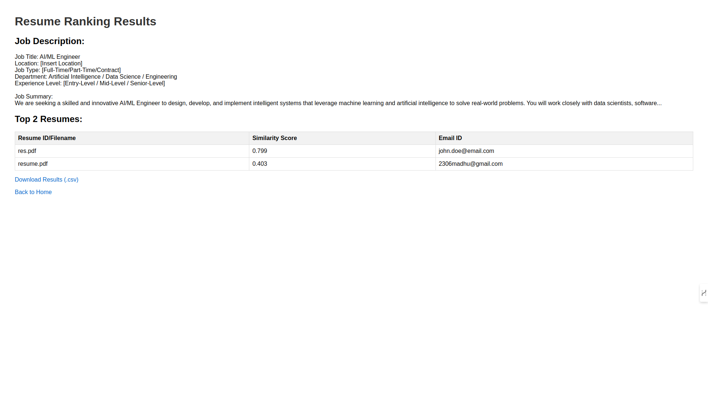

# AI-Powered Resume Ranker: Semantic Screening Dashboard 🚀

The AI-Powered Resume Ranker is a sophisticated web application that automates resume screening using a **hybrid LLM/NLP architecture**. It provides superior ranking accuracy through **Sentence-BERT (SBERT)** and offers advanced qualification via **GPT-powered scoring and justification**.

The application now runs as a single-page dashboard built with **Streamlit**, offering stability, data persistence, and a modern user experience.

Explore the live app at [https://ai-resume-ranker-pb4m.onrender.com/](https://ai-resume-ranker-pb4m.onrender.com/). **Note: The initial page load may take 2-3 minutes. This delay is due to the service performing a cold start.**


## Features

- **Hybrid Ranking (LLM/SBERT)**: Uses **SBERT** (`all-mpnet-base-v2`) for fast semantic similarity filtering, then uses an **LLM (GPT-3.5-turbo)** to generate a final, qualitative **Fit Score (1-10)** and detailed justification. Includes a fallback to SBERT scoring if the LLM API call fails.
- **Direct Resume Download**: After ranking, users can **manually download the corresponding `.pdf` or `.txt` resume file directly from the results page** for immediate review.
- **Strict Keyword Pre-Screening**: If keywords are entered, **only** resumes that contain at least one of the specified keywords will be considered for ranking. All others are immediately filtered out.
- **Data Persistence (SQLite)**: Stores all parsed resume data, email, and raw text in a dedicated **SQLite database** (in-memory cache for deployment).
- **Database Viewer**: A separate dashboard page allows users to view, search, and download all stored candidate records as a CSV.
- **Resume Retrieval**: Candidates' original files can be downloaded directly from the results page using the file bytes stored in the database.
- **Universal Extraction**: Attempts to extract **Skills, Experience, and Education** based on resume section headers, making the system universal for different job types.
- **Justification & Key Matches**: Identifies the primary technical overlaps using TF-IDF and presents them as justification tags, supporting the LLM's final score.
- **Optimized Performance**: SBERT model is loaded only once using Streamlit's `@st.cache_resource`, ensuring fast reruns after the initial load.

## Technical Stack

| Component               | Technology                              | Role                                                                        |
| :---------------------- | :-------------------------------------- | :-------------------------------------------------------------------------- |
| **Framework**           | **Streamlit**                           | Single-page application (SPA) dashboard and UI.                             |
| **Semantic Matching**   | **Sentence-BERT** (`all-mpnet-base-v2`) | Vectorization and Cosine Similarity scoring.                                |
| **Qualitative Scoring** | **OpenAI API (GPT-3.5-turbo)**          | LLM-based Fit Score (1-10) and natural language justification.              |
| **Data Persistence**    | **SQLite**                              | In-memory database for storing parsed resume records (`parsed_resumes.db`). |

## Screenshots


_Upload job descriptions and resumes, configure LLM key, and select ranking options._


_View ranked resumes with **Fit Scores**, **justification**, and extracted **structured data**. Download selected ranking results as a CSV and **download the original resume file directly** for immediate manual review._


_Access the persistent database of all previously uploaded and parsed resumes._

## Running Locally

1. **Install Dependencies** (Ensure Python 3.8+ is used):
   ```bash
   pip install -r requirements.txt
   ```
2. **Run the Streamlit App:**:
   - The application now runs via the single app.py script.
   ```bash
   streamlit run app.py
   ```
3. Access the App:
   - Open the URL displayed in the terminal (typically http://localhost:8501).
   - Note: Use of the LLM requires setting the OpenAI API key in the sidebar.

## Deployment

The app is live at [https://ai-resume-ranker-pb4m.onrender.com/](https://ai-resume-ranker-pb4m.onrender.com/). To deploy your own instance on Render:

- **Corrected Start Command**: The deployment command is designed for Render's environment.
- Set the OPENAI_API_KEY as an environment variable in the deployment settings for LLM functionality.

## Limitations

- **PDF Extraction**: Complex table layouts or scanned PDFs may still yield inconsistent text for structured data fields (Experience, Education).
- **API Dependency**: LLM ranking requires a valid OpenAI API Key.
- **Pre-trained Model**: The base SBERT model is not fine-tuned on recruiting data.
